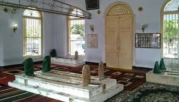
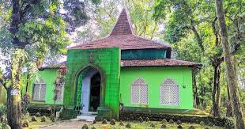

<!DOCTYPE html>
<html>
<head>
	<title>Pesona Wisata Religi di Pekalongan</title>
	
</head>
<body>
	

		
		<h1>Pesona Wisata Religi di Pekalongan</h1>
		
Pekalongan dikenal sebagai kota yang memiliki banyak tempat wisata religi yang indah dan menarik. Beberapa tempat wisata religi yang populer di Pekalongan antara lain:

		<ul>
			<li><strong>Makam Habib Ahmad bin Abdullah bin Thalib:</strong> Makam ini cukup terkenal dipekalongan.</li>
        </ul>
	

        
    
	
        <ul>
            <li><strong>Makam Maulana habib Abu Bakar Bin Yahya:</strong> Makam ini merupakan makam kakek dari seorang Habib yang terkenal di Dunia yaitu Habib Luthfi Bin Ali Bin Yahya.</li>
        </ul>
    

        
    

		
    

</body>
</html>
        
